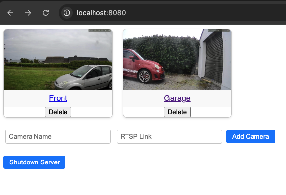
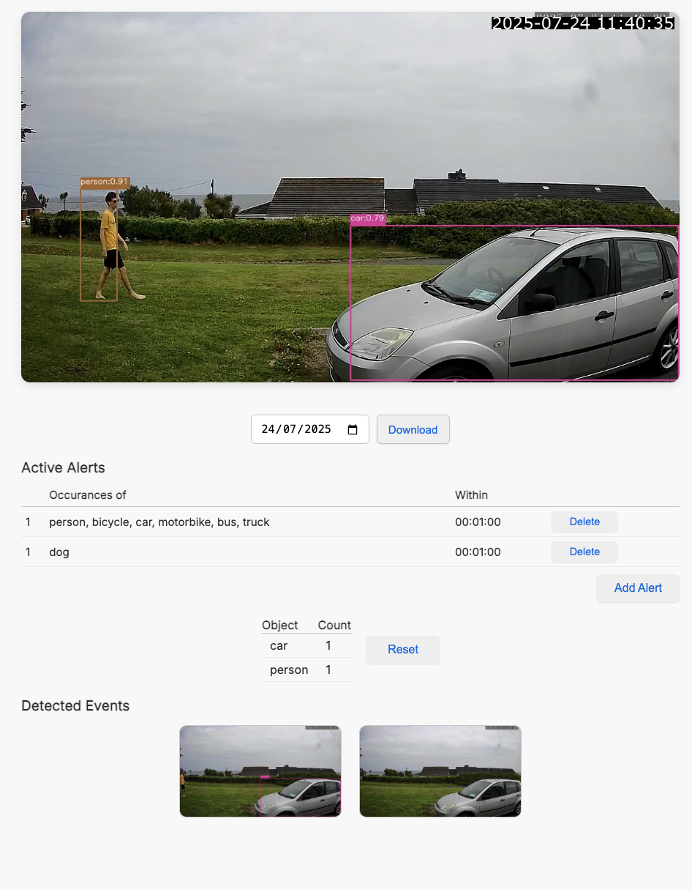
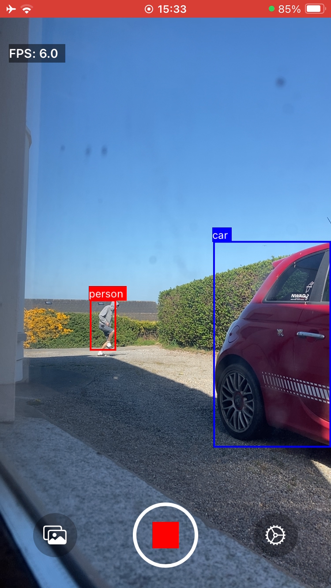
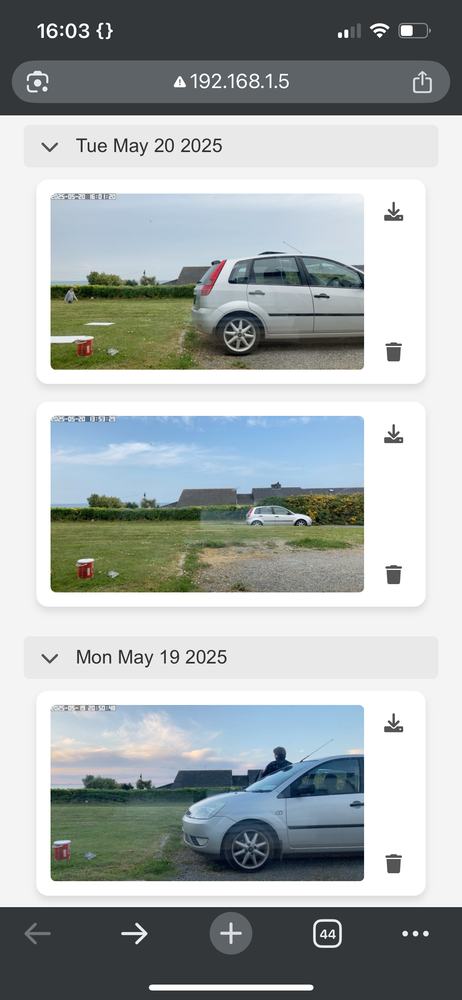
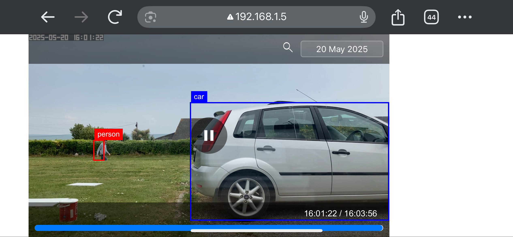

# clearcam
# Turn your RTSP enabled camera or old iPhone into a state of the art AI Security Camera

  
  &nbsp;&nbsp;&nbsp;
  

## video demo:
https://x.com/RoryClear/status/1959249250811785405

## install and run NVR + inference with homebrew
1. brew tap roryclear/tap
2. brew install clearcam
3. clearcam
4. (optional) enter your Clearcam premium userID (viewable in iOS app) to receive streams and notifications
5. open localhost:8080 in your browser

## run NVR + inference in python (from source)
1. pip install -r requirements.txt
2. python3 clearcam.py
3. (optional) enter your Clearcam premium userID (viewable in iOS app) to receive streams and notifications
4. open localhost:8080 in your browser
- use BEAM=2 python3 clearcam.py for extra performance (wait time on first run)
- use --yolo_size={s, m, l, or x for larger yolov8 variants}

## python requirements
- ffmpeg (installed on your computer)
- tinygrad
- numpy
- cv2
- scipy

## install ios from source
1. git clone https://github.com/roryclear/clearcam.git
2. open ios/clearcam.xcodeproj

## iOS requirements
- iOS 15 or newer
- iPhone SE (1st gen) or newer (older iPhones *might* work)
- dependencies: NONE!

 
<table>
  <tr>
    <td></td>
    <td></td>
  </tr>
</table>

# Signing Up for Clearcam Premium

## Features
- View your live camera feeds remotely.
- Receive notifications on events (objects/people detected).
- View event clips remotely.
- End-to-end encryption on all data.

## How to Sign Up on Android

Sign ups on android are not yet supported. (App is not approved for Google Play Store yet)
In the meantime, please refer to the [How to Sign Up on iOS](#how-to-sign-up-on-ios) section and use the user ID on android.

## How to Sign Up on iOS

1. **Install Clearcam** from the App Store.
2. Open the app and go to **Settings**.
3. Tap **Upgrade to Premium**.
4. Complete the payment using the App Store’s secure checkout.
5. After upgrading, return to **Settings** in Clearcam.
6. Locate your **User ID**, you’ll use this to log in on any device.
