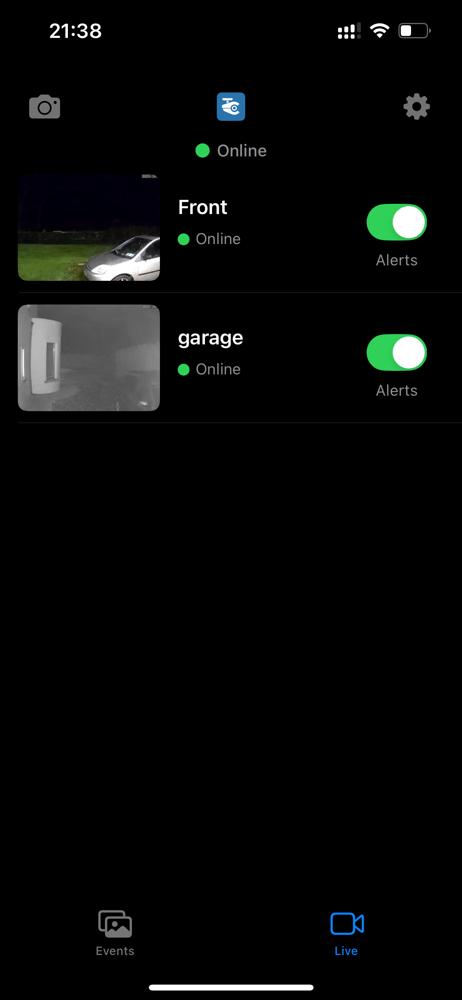
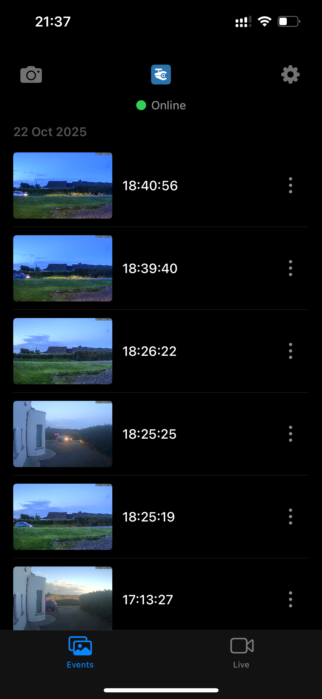

  

# clearcam: Turn your RTSP enabled camera or old iPhone into a state of the art AI Security Camera

<table border="0" cellspacing="0" cellpadding="0">
  <tr>
    <td align="center">
      
    </td>
    <td align="center">
      
    </td>
  </tr>
</table>

<table align="center" cellspacing="0" cellpadding="0" style="border-collapse: collapse;">
  <tr valign="top">
    <td style="padding-right: 10px;">
       
       
      
    </td>
    <td>
      
    </td>
    <td>
      
      
    </td>
  </tr>
</table>

### Don't own an RTSP camera yet?
Try it out with this feed: https://webcam.elcat.kg/Too-Ashu_Tunnel_North/index.m3u8 (https://kg.camera)

## video demo:
https://x.com/RoryClear/status/1959249250811785405

## install and run NVR + inference with homebrew (old release)
1. brew tap roryclear/tap
2. brew install clearcam
3. clearcam
4. (optional) enter your Clearcam premium userID (viewable in iOS app) to receive streams and notifications
5. open localhost:8080 in your browser

## run NVR + inference in python from source (recommended)
1. pip install -r requirements.txt
2. python3 clearcam.py
3. (optional) enter your Clearcam premium userID (viewable in iOS app) to receive streams and notifications
4. open localhost:8080 in your browser
- use BEAM=2 python3 clearcam.py for extra performance (wait time on first run)

## python requirements
- ffmpeg (installed on your computer)
- tinygrad
- numpy
- cv2
- scipy

## install iOS App from source
1. git clone https://github.com/roryclear/clearcam.git
2. open ios/clearcam.xcodeproj

## iOS requirements
- iOS 15 or newer
- iPhone SE (1st gen) or newer (older iPhones *might* work)
- dependencies: NONE!

 
<table>
  <tr>
    <td></td>
    <td></td>
  </tr>
</table>

# Signing Up for Clearcam Premium

## Features
- View your live camera feeds remotely.
- Receive notifications on events (objects/people detected).
- View event clips remotely.
- End-to-end encryption on all data.

## How to Sign Up

Visit [rors.ai](https://www.rors.ai) to sign up, or upgrade to premium in the iOS app.
